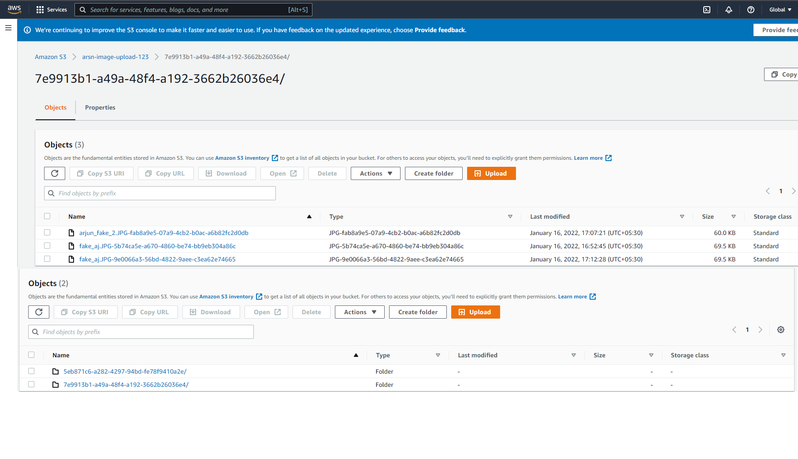

# aws-react-image-uploader
An Image uploader to Aws S3 bucket using Spring boot and React.

We have a spring boot backend which provides rest end points upload and download the images.

And a front end designed in react to upload the images.

We store the files in AWS s3 bucket with each users folder, so we keep track of all the images uploaded so far.

As of now using a fake in memory database to store the user data.

Drag and drop like the below with the image you want to upload

the files saved in s3.

